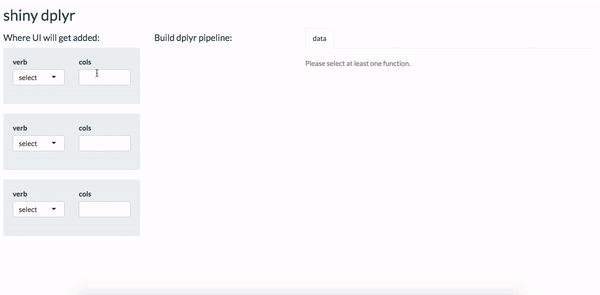

# shiny_dplyr

I started to make a shiny app to help beginners learn dplyr, based on [Jesse](https://twitter.com/kierisi)'s [tweet](https://twitter.com/kierisi/status/1036293295352229889) (with her [permission](https://twitter.com/kierisi/status/1036395821091172353)), but stopped when I heard RStudio was developing [TidyBlocks](https://vimeo.com/350227891).

**current status:**  
At the moment, the data transformation works by creating a string to represent each action, putting them together in the dragged order, then parsing and evaluating the combined string. A few verbs are supported, but the only arguments accepted are column names. For some verbs, the formatting only works with one column right now.  

